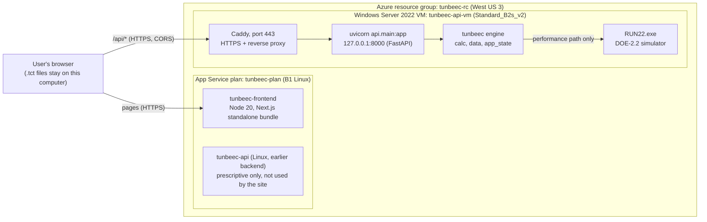
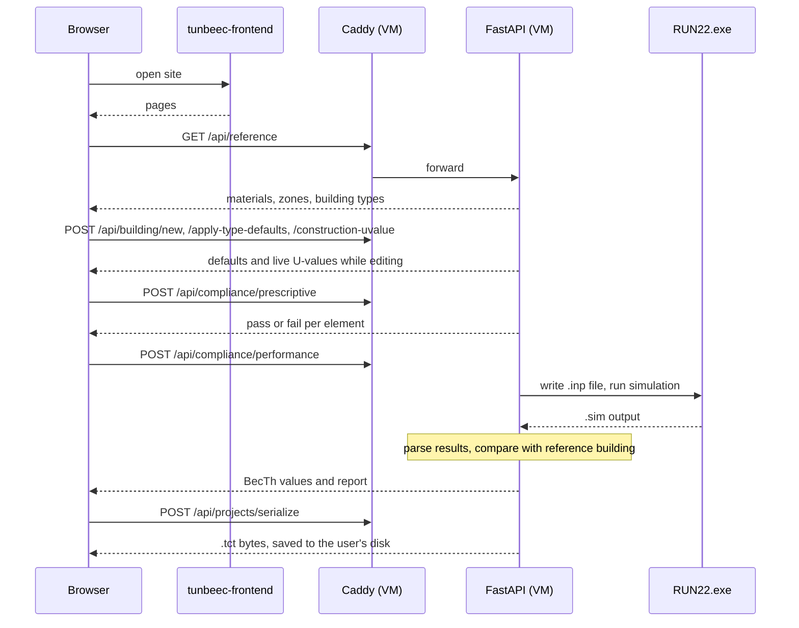
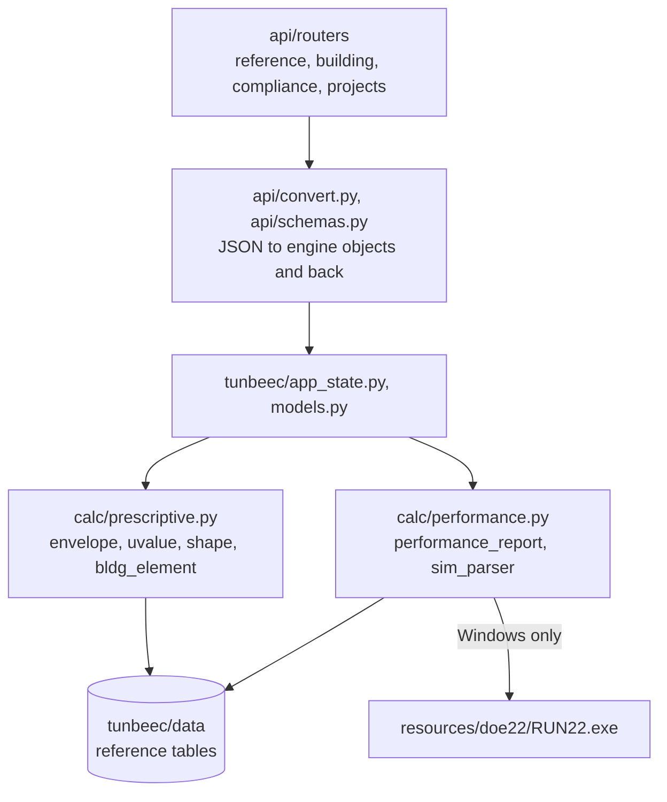
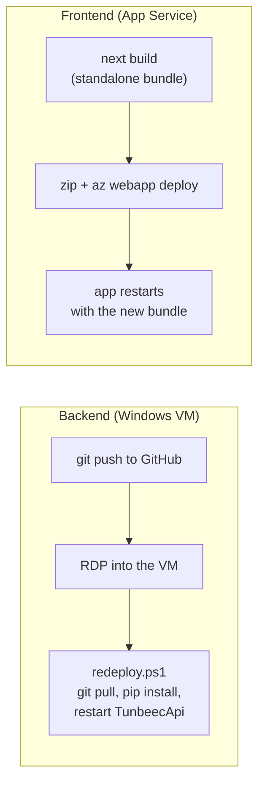

# TUNBEEC

Tunisian building energy code compliance tool (ANME). A user describes a building (general
data, envelope, windows, spaces, HVAC) and checks it against the code in two ways:

- **Prescriptive approach**: each element is compared with fixed limits. Pure Python, runs
  anywhere.
- **Performance approach** ("Approche Performancielle"): the whole building is simulated with
  DOE-2.2 (`resources/doe22/RUN22.exe`) and compared with a reference building. DOE-2.2 is a
  Windows-only program.

## Concepts in one minute

- **One engine, several front doors.** `python_tunbeec/tunbeec/` holds all the calculations.
  The desktop GUI, the web API and the Windows installer all call the same code.
- **Frontend / backend split.** The web screens (`client/`) and the API (`python_tunbeec/api/`)
  are separate apps that talk over HTTPS.
- **Why a virtual machine.** Azure's managed web hosting runs Linux, and `RUN22.exe` cannot run
  there. The API therefore runs on a rented Windows computer (a VM) that we manage ourselves.
- **Windows service.** NSSM registers the API (`TunbeecApi`) and the proxy (`TunbeecCaddy`) as
  services, so they start on boot and restart after a crash without anyone logged in.
- **Reverse proxy and HTTPS.** Caddy listens on port 443, obtains and renews a free Let's
  Encrypt certificate, and forwards requests to the API on `localhost:8000`.
- **CORS.** The API only answers browser requests from the origin in `ALLOWED_ORIGINS`.
- **Build-time configuration.** `NEXT_PUBLIC_API_BASE` (in `client/.env.production`) is baked
  into the client bundle at build time. Changing it needs a rebuild and redeploy.
- **Stateless server.** Project files (`.tct`) open and save on the user's own computer through
  the browser. The server only converts between `.tct` bytes and JSON.

## System architecture on Azure



Live addresses: screens at `https://tunbeec-frontend.azurewebsites.net`, API at
`https://tunbeec-api-vm.westus3.cloudapp.azure.com`.

## How a compliance check runs



## Inside the backend



## How a change gets deployed



VM setup and update steps: [python_tunbeec/deploy/windows-vm/README.md](python_tunbeec/deploy/windows-vm/README.md).

## Cost: keeping it live 24 hours a day

| Piece | Runs on | Approx. cost |
|---|---|---|
| Screens | `tunbeec-frontend` on a B1 Linux plan | ~$13/month |
| API + DOE-2.2 | Windows VM `Standard_B2s_v2` (2 vCPU, 8 GB), on all day | ~$67/month list price |
| VM OS disk | 127 GB Premium SSD (P10) | ~$18/month list price |
| VM public IP | Standard static IP | Billed separately, a few dollars a month |

Figures are estimates from the setup notes, not invoices. The VM is very likely the largest
line, so start there.

1. **Buy the VM hours in advance.** A pay-as-you-go VM is the most expensive way to run a
   machine that never switches off. A one-year reserved instance or an Azure savings plan for
   compute lowers the hourly rate in exchange for a commitment. This subscription is managed
   through OIT, so the purchase may have to go through them.
2. **Ask about Azure Hybrid Benefit.** Part of a Windows VM's price is the Windows Server
   licence. If the university's licences qualify, enabling Hybrid Benefit removes that part:
   ```bash
   az vm update -g tunbeec-rc -n tunbeec-api-vm --license-type Windows_Server
   ```
   Only run this once OIT confirms the licence entitlement.
3. **Check the VM is not oversized.** Look at CPU and memory under the VM's Metrics during a
   performance run. One DOE-2.2 simulation at a time is a light load. Measured over the two
   weeks to 2026-10-05: CPU averages 1.5% and about 6.4 GB of the 8 GB memory is free.
   `Standard_B2ls_v2` (2 vCPU, 4 GB) lists at ~$37/month, a saving of ~$30/month, and needs one
   restart of a few minutes (`az vm resize -g tunbeec-rc -n tunbeec-api-vm --size Standard_B2ls_v2`).
   Other sizes in the same family (`az vm list-vm-resize-options -g tunbeec-rc -n tunbeec-api-vm -o table`).
4. **Use a Standard SSD OS disk.** Premium SSD gives no benefit for this workload. Standard SSD
   (E10) lists at ~$10/month against ~$18 for the current P10:
   ```bash
   az vm show -g tunbeec-rc -n tunbeec-api-vm --query "storageProfile.osDisk.managedDisk.storageAccountType"
   ```
   Changing the disk type requires a short stop of the VM, so plan a maintenance window.
5. **Remove the unused Linux API.** `tunbeec-api` no longer serves the site but still takes
   memory on the B1 plan, which runs at about 72% memory. Deleting it gives the front end more
   headroom at no cost.
6. **Turn on Always On** for the front end
   (`az webapp config set -g tunbeec-rc -n tunbeec-frontend --always-on true`).
7. **Do not use auto-shutdown.** It is the usual VM saving, but the whole tool goes down with
   the VM, which breaks the 24-hour requirement.
8. **Set a budget alert** under Cost Management → Budgets.

## Repository layout

This repo has two front doors onto the same compliance engine (`python_tunbeec/tunbeec/`):

| Path | What it is |
|---|---|
| `python_tunbeec/` | Core engine (`tunbeec/calc`, `tunbeec/data`, `tunbeec/app_state`) + the original PySide6 desktop GUI (`main.py`, `tunbeec/ui/`). |
| `python_tunbeec/api/` | FastAPI backend — thin HTTP layer over the same engine, unmodified. |
| `client/` | Next.js + TypeScript web frontend that talks to `python_tunbeec/api/`. Full feature parity with the desktop app. |
| `windows_exe/` | PyInstaller + Inno Setup packaging for a standalone `TUNBEEC-Setup.exe` desktop installer. **Not used by the web deployment below** — that's a separate distribution path for people who want the offline desktop app. |

## Local development

Backend:
```bash
cd python_tunbeec
source venv/bin/activate   # venv already has fastapi/uvicorn installed
uvicorn api.main:app --reload --port 8000
```

Frontend (needs `client/.env.local` with `NEXT_PUBLIC_API_BASE=http://localhost:8000`):
```bash
cd client
npm run dev
```

## Deploying the web app to Azure (no exe file, no VM)

> **Current status:** the live site no longer uses the Linux backend described in this section.
> The front end points at the Windows VM (`client/.env.production`), set up as described in
> [python_tunbeec/deploy/windows-vm/README.md](python_tunbeec/deploy/windows-vm/README.md). The
> steps below still apply to the front end, and to the Linux backend if a prescriptive-only
> deployment is ever wanted again. The front end is now built as a standalone bundle
> (`output: "standalone"` in `client/next.config.ts`), so check that file's note before using the
> source-zip commands in step 2.

Both `client/` and `python_tunbeec/api/` deploy as plain **Azure App Service (Linux)** web apps
sharing one App Service Plan — fully managed, deploy by pushing code, nothing to RDP/SSH into.

- **Frontend** (`client/`) → App Service, Linux, Node 20 — `next build && next start`.
- **Backend** (`python_tunbeec/api/`) → App Service, Linux, Python 3.11 — `uvicorn`.

**Trade-off**: the "Approche Performencielle" step shells out to `resources/doe22/RUN22.exe`, a
Windows-only 32-bit binary (see `python_tunbeec/INSTALL.md` §5) — it cannot run on Linux, and
Wine/emulation don't work either. On this Linux backend, that step still generates the `.inp` BDL
file, but the API returns `status: "simulation_unavailable"` instead of an auto-run result — the
exact same graceful fallback the desktop app already shows on Mac/Linux today
(`python_tunbeec/tunbeec/calc/performance.py`, `sys.platform != "win32"` check). The
**Prescriptive** compliance path is unaffected and works fully. See "Optional: add a Windows VM
later" at the bottom if live DOE-2.2 simulation in the cloud becomes a requirement — it's an
additive step, not a redo of anything here.

> **Already have `tunbeec-rc` / `tunbeec-api` / `tunbeec-frontend` running?** Skip straight to
> [Redeploying after code changes](#redeploying-after-code-changes) — it's just the two
> `az webapp deploy` commands below, no resource-creation steps to repeat.

Everything below uses the [Azure CLI](https://learn.microsoft.com/cli/azure/install-azure-cli)
(`az login` first). Replace the example names with your own if they're taken — App Service names
are globally unique across all of Azure, not just your subscription.

> **Copy-paste tip**: every command is written as a single line on purpose — some terminals mangle
> multi-line `\`-continued commands on paste. Run one line at a time.

> **Region note for CU Boulder's `azucob0ceaelbslw` / `OIT_Public_Cloud_Broker_Managed` subscription**:
> this subscription enforces a per-region quota allow-list. `eastus`, `eastus2`, and `centralus` all
> reject App Service (Linux) compute with `Current Limit (Total VMs): 0`. **`westus3` is confirmed
> working** for Linux App Service Plans on this subscription. All commands below already use `westus3`. If
> a fresh subscription/tenant hits the same `Total VMs: 0` error somewhere else, check
> **Portal → Subscriptions → Usage + quotas** (filter: App Service) for the exact allowed region(s)
> before retrying, rather than guessing regions one at a time.

### 0. Resource group + shared App Service Plan

One Linux plan hosts both apps (isolated processes, shared compute), so this is a single line
item on the bill instead of two:
```bash
az group create --name tunbeec-rc --location westus3
```
```bash
az appservice plan create --name tunbeec-plan --resource-group tunbeec-rc --sku B1 --is-linux --location westus3
```

### 1. Backend — `python_tunbeec/api/` on Python 3.11

```bash
az webapp create --resource-group tunbeec-rc --plan tunbeec-plan --name tunbeec-api --runtime "PYTHON:3.11"
```
```bash
az webapp config set --resource-group tunbeec-rc --name tunbeec-api --startup-file "uvicorn api.main:app --host 0.0.0.0 --port 8000"
```

`ALLOWED_ORIGINS` (read by `api/main.py`'s CORS middleware) must match the frontend's URL from
step 2 exactly:
```bash
az webapp config appsettings set --resource-group tunbeec-rc --name tunbeec-api --settings ALLOWED_ORIGINS=https://tunbeec-frontend.azurewebsites.net SCM_DO_BUILD_DURING_DEPLOYMENT=true
```

Deploy. This stages `python_tunbeec/` into a temp folder and swaps in `api/requirements.txt` as
the root `requirements.txt` — Azure's build step (Oryx) only looks at the one at the deployment
root, and the real root one (`python_tunbeec/requirements.txt`) is PySide6 for the desktop GUI,
which this deployment doesn't need or want:
```bash
rm -rf /tmp/tunbeec-api-deploy && mkdir -p /tmp/tunbeec-api-deploy
```
```bash
rsync -a --exclude 'venv' --exclude '__pycache__' --exclude '*.pyc' --exclude 'applog.txt' "python_tunbeec/" /tmp/tunbeec-api-deploy/
```
```bash
cp python_tunbeec/api/requirements.txt /tmp/tunbeec-api-deploy/requirements.txt
```
```bash
cd /tmp/tunbeec-api-deploy && zip -r /tmp/tunbeec-api.zip . -x ".*" && cd -
```
```bash
az webapp deploy --resource-group tunbeec-rc --name tunbeec-api --src-path /tmp/tunbeec-api.zip --type zip
```

Verify:
```bash
curl https://tunbeec-api.azurewebsites.net/api/health
# {"status":"ok"}
```

### 2. Frontend — `client/` on Node 20

```bash
az webapp create --resource-group tunbeec-rc --plan tunbeec-plan --name tunbeec-frontend --runtime "NODE:20-lts"
```
```bash
az webapp config set --resource-group tunbeec-rc --name tunbeec-frontend --startup-file "npm run start"
```

`NEXT_PUBLIC_API_BASE` gets baked into the JS bundle **at build time**, so set it before the first
build runs — Oryx picks up App Settings as build-time env vars:
```bash
az webapp config appsettings set --resource-group tunbeec-rc --name tunbeec-frontend --settings NEXT_PUBLIC_API_BASE=https://tunbeec-api.azurewebsites.net SCM_DO_BUILD_DURING_DEPLOYMENT=true
```

Deploy the source (zip-deploy triggers the Oryx build server-side, so `node_modules`/`.next`
don't need to be in the zip):
```bash
cd client && zip -r ../client.zip . -x "node_modules/*" ".next/*" && cd ..
```
```bash
az webapp deploy --resource-group tunbeec-rc --name tunbeec-frontend --src-path client.zip --type zip
```

Your app is live at `https://tunbeec-frontend.azurewebsites.net`.

### Redeploying after code changes

Once `tunbeec-rc` / `tunbeec-plan` / `tunbeec-api` / `tunbeec-frontend` already exist, pushing an
update to either side is just re-running its zip-and-deploy commands — nothing from step 0 needs
repeating, and `az webapp create`/`config set`/`appsettings set` only need to be re-run if you're
changing the runtime, startup command, or an env var (e.g. `ALLOWED_ORIGINS` after a custom domain).

**Backend changed** (anything under `python_tunbeec/`):
```bash
rm -rf /tmp/tunbeec-api-deploy && mkdir -p /tmp/tunbeec-api-deploy
```
```bash
rsync -a --exclude 'venv' --exclude '__pycache__' --exclude '*.pyc' --exclude 'applog.txt' --exclude 'PROJECT' "python_tunbeec/" /tmp/tunbeec-api-deploy/
```
```bash
cp python_tunbeec/api/requirements.txt /tmp/tunbeec-api-deploy/requirements.txt
```
```bash
cd /tmp/tunbeec-api-deploy && zip -r /tmp/tunbeec-api.zip . -x ".*" && cd -
```
```bash
az webapp deploy --resource-group tunbeec-rc --name tunbeec-api --src-path /tmp/tunbeec-api.zip --type zip
```
```bash
curl https://tunbeec-api.azurewebsites.net/api/health   # {"status":"ok"} once the restart finishes
```

**Frontend changed** (anything under `client/`):
```bash
cd client && rm -f ../client.zip && zip -r ../client.zip . -x "node_modules/*" ".next/*" && cd ..
```
```bash
az webapp deploy --resource-group tunbeec-rc --name tunbeec-frontend --src-path client.zip --type zip
```

Both deploys trigger an Oryx build server-side and take 1-3 minutes; watch progress with
`az webapp log tail --resource-group tunbeec-rc --name <tunbeec-api|tunbeec-frontend>` if a deploy
seems stuck or the app 500s after redeploying. If a change touched **both** sides in a way that
changes the wire contract between them (new/renamed API route, new required field), deploy the
backend first, then the frontend — the frontend calls a fixed `NEXT_PUBLIC_API_BASE` and does no
version negotiation.

### 3. Notes

- **Cost**: one `B1` Linux App Service Plan hosting both apps is ~$13/mo total — no per-app
  compute cost since they share the plan.
- **Custom domain**: `az webapp config hostname add` on either app, then re-run its
  `ALLOWED_ORIGINS`/`NEXT_PUBLIC_API_BASE` app-settings step with the new hostname (these are
  build/runtime-time values, not auto-updated).
- **Project files live on the user's own computer, not the server.** Open/Save/Save As use the
  browser's File System Access API (native OS file dialogs in Chromium; a download + `<input
  type="file">` picker fallback elsewhere) — the `.tct` never touches App Service disk. The backend
  only exposes two stateless conversion endpoints, `POST /api/projects/serialize` (JSON → `.tct`
  bytes) and `POST /api/projects/parse` (`.tct` bytes → JSON); nothing is written to
  `PROJECT_DIR` except DOE-2.2's own scratch `.inp`/`.sim` files during a Performance run, which
  a zip redeploy is fine to wipe. There is no Azure Files / persistent-storage step to worry about.

### Optional: add a Windows VM later for live DOE-2.2 simulation

> **Done.** The VM exists as `tunbeec-api-vm` and serves the live site. Its setup and update
> steps are in [python_tunbeec/deploy/windows-vm/README.md](python_tunbeec/deploy/windows-vm/README.md).
> The paragraph below is kept as background.

If the Prescriptive-only limitation above becomes a blocker, the Performance/DOE-2.2 path can be
added by standing up one more resource — an Azure VM running Windows Server, with
`python_tunbeec/api` running there instead of (or as a second backend alongside) the Linux one,
fronted by a reverse proxy for HTTPS. This is additive (new VM + `nssm`-registered service + Caddy
for TLS), not a redo of the Linux setup above. Ask when you're ready to add it — worth noting for
when that happens: on this subscription the `Standard_B*` burstable VM family isn't offered in any
region tried, but `Standard_D2as_v7` in `eastus2` is confirmed to provision successfully, and
Windows VM computer names must be ≤15 characters (set via `--computer-name`, separate from the
Azure resource `--name`).
